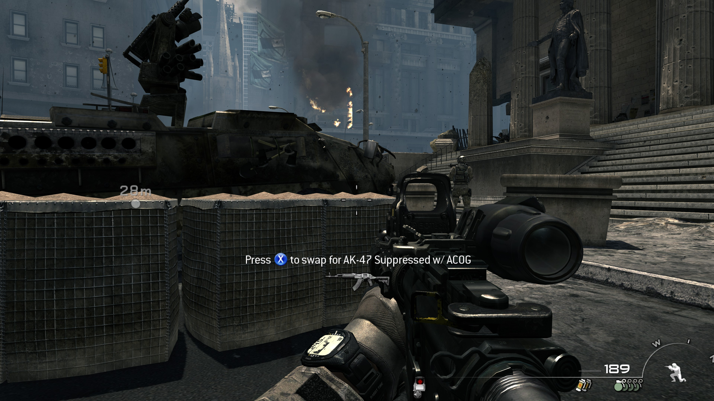
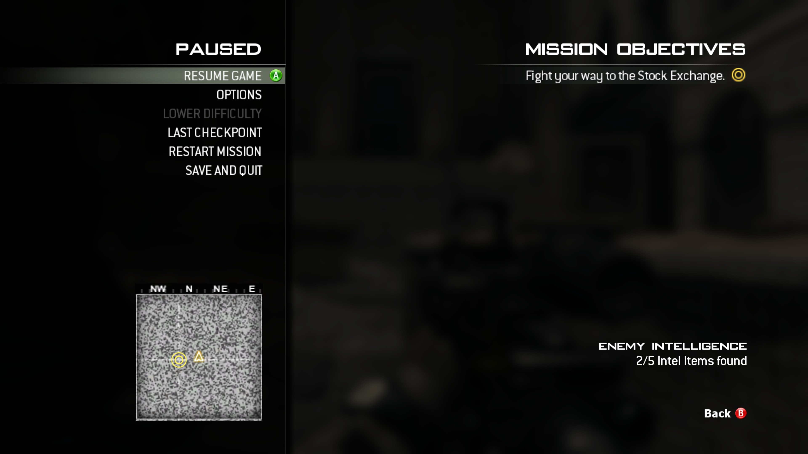

# MW3GamepadFix

| Feature | Status |
| :--- | :---: |
| **Xbox / PlayStation button prompts** | ✅ Supported |
| **Menu navigation** | ✅ Supported |
| **Analog movement and camera** | ✅ Supported |
| **Game mode** | Single-player |
| **Game version** | **2.0.15** (x64) |

Gamepad controls and Xbox / PlayStation button prompts for the **Call of Duty: Modern Warfare 3 (2011) single-player campaign on PC**. Keeps the PC menus and graphics settings, with controller navigation, analog movement and camera control.

**Version 0.8.2 is a pre-release.** Full campaign verification is ongoing.

## In-game preview

<table width="100%">
  <tr>
    <td width="50%" align="center">
      <a href="https://raw.githubusercontent.com/TheTronuo/MW3GamepadFix/main/assets/screenshots/gameplay.jpg"></a>
    </td>
    <td width="50%" align="center">
      <a href="https://raw.githubusercontent.com/TheTronuo/MW3GamepadFix/main/assets/screenshots/pause-menu.jpg"></a>
    </td>
  </tr>
</table>

## Install

1. Close the game.
2. [Download **MW3GamepadFix-0.8.2-ASI.zip**](https://github.com/TheTronuo/MW3GamepadFix/releases/download/v0.8.2/MW3GamepadFix-0.8.2-ASI.zip).
3. Extract the archive into the game folder containing `iw5sp.exe`. Place `winmm.dll`, `MW3GamepadFix.asi` and `MW3GamepadFix.ini` next to that executable.
4. Launch single-player normally.

Requires **64-bit Windows** and the supported `iw5sp.exe` build. The mod checks the executable before enabling its hooks; see [compatibility and verification](docs/verification.md). Multiplayer is unsupported. Download the ZIP under the release's **Assets**; the source archives are for developers.

Game archives and the executable are not modified. To uninstall, close the game and remove the three installed files. If you already use an ASI loader or another `winmm.dll` mod, keep your existing loader rather than overwriting it.

## Settings

Edit `MW3GamepadFix.ini` next to `iw5sp.exe`:

```ini
[Input]
enabled=1
backend=xinput
prompts=x360
```

| Setting | Values |
| :--- | :--- |
| `enabled` | `1` to enable, `0` to disable |
| `backend` | `xinput` (default), `gameinput`, or `auto` |
| `prompts` | `x360` for Xbox icons (default), `ps3` for PlayStation icons |

Restart the game after changing settings. Prompt style is independent of the input backend and game language. XInput-compatible controllers work with the default backend. PlayStation controllers need an XInput mapping tool or the GameInput backend; GameInput requires its Microsoft runtime.

## Credits

Includes [Ultimate ASI Loader](https://github.com/ThirteenAG/Ultimate-ASI-Loader), [MinHook](https://github.com/TsudaKageyu/minhook), and the Microsoft GameInput SDK. Original button artwork and dependency licenses are documented in [third-party notices](THIRD_PARTY_NOTICES.md).

[Build instructions](docs/build.md) · [Compatibility and verification](docs/verification.md)
